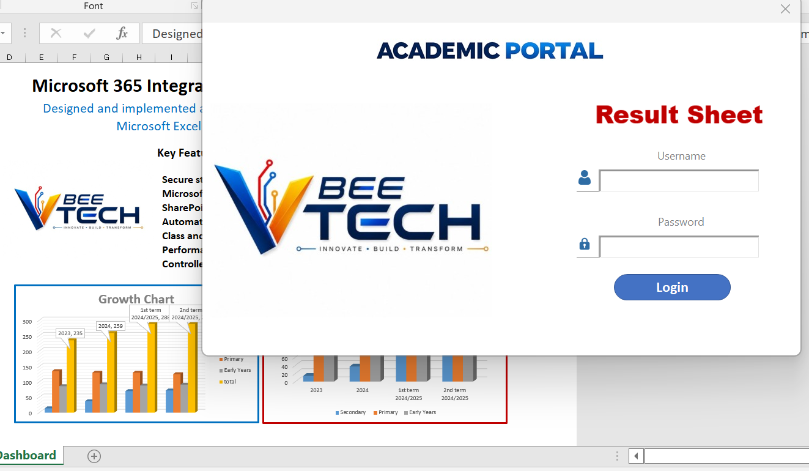
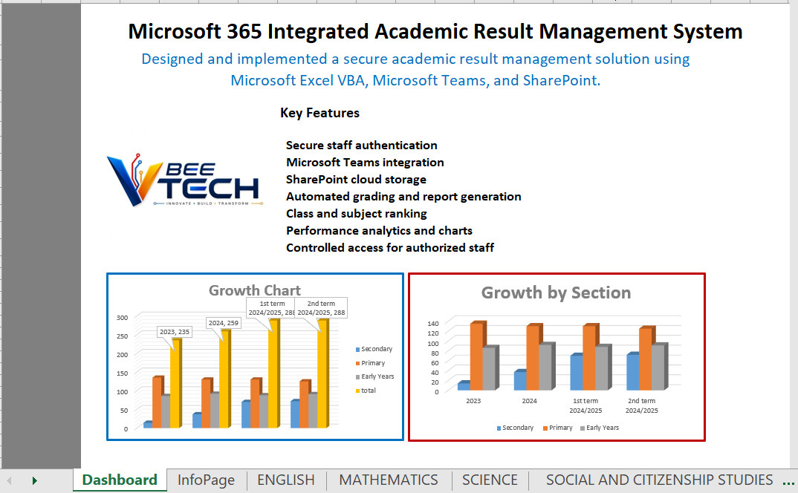
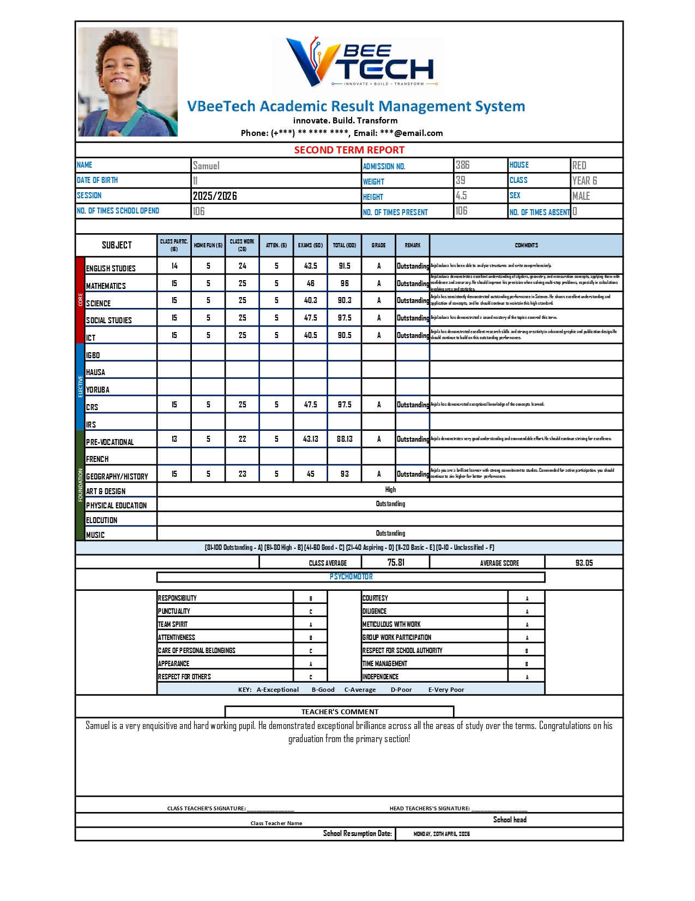
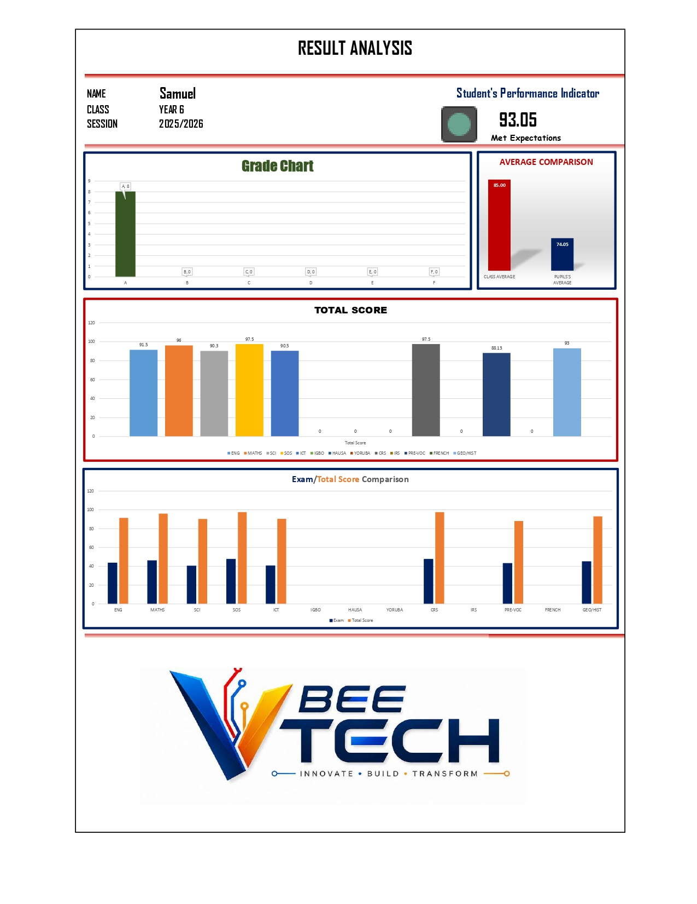
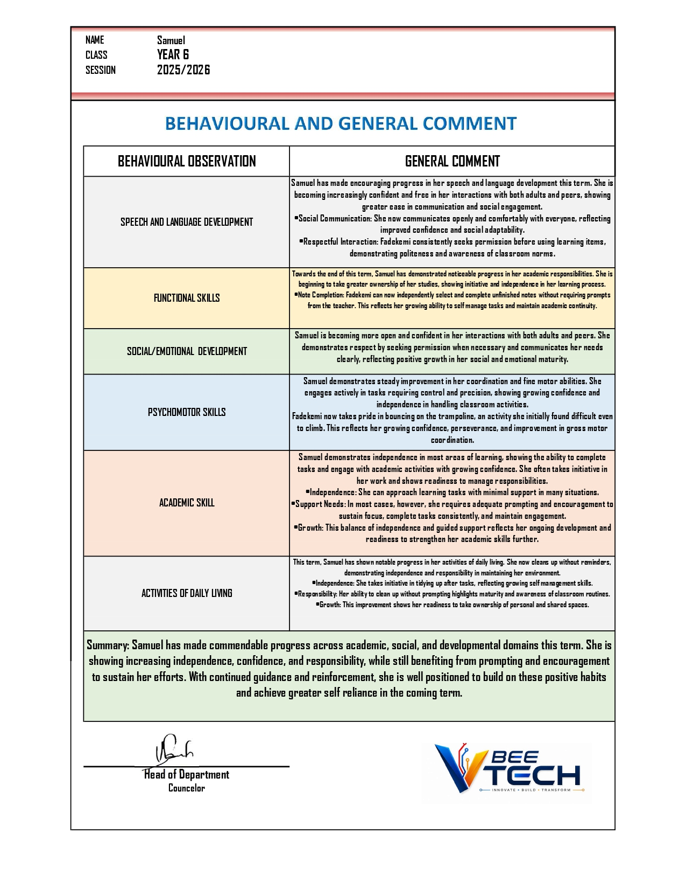
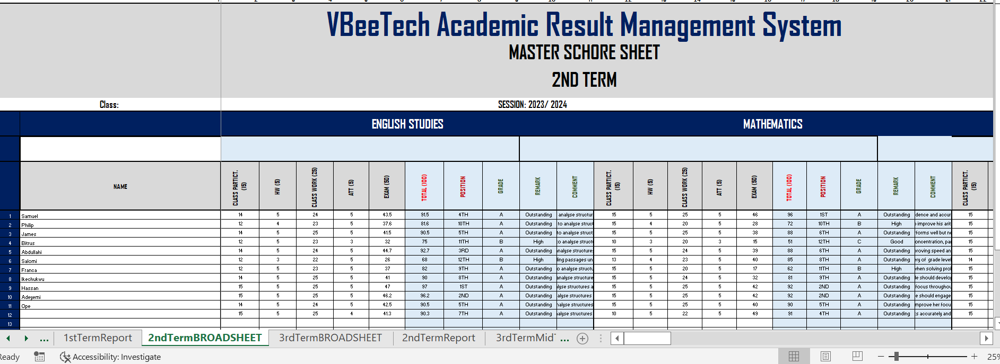
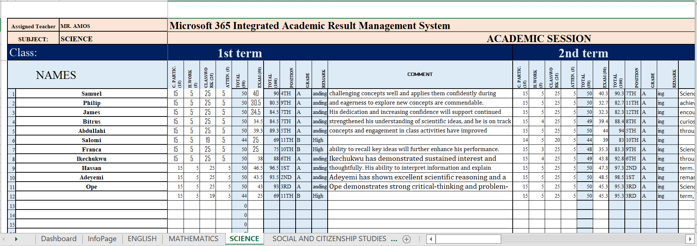
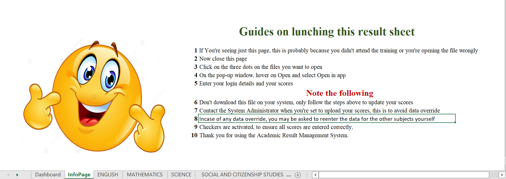

# Microsoft 365 Integrated Academic Result Management System

## 🚀 Project Highlights

- Secure login and role-based access for authorized staff.
- Microsoft Teams and SharePoint integration for centralized collaboration.
- Automated result computation, grading, and report card generation.
- Class broadsheet generation with analytics and performance insights.
- Behavioural assessment and general comment management.
- Built with Microsoft Excel VBA for schools using Microsoft 365.

A secure Microsoft 365-integrated Student Result Management System built with Microsoft Excel, Microsoft Teams, and SharePoint to automate academic result processing while ensuring authorized access for staff.

---

## Overview

This project was developed to improve how schools prepare, manage, and publish student results.

Instead of relying on multiple offline spreadsheets, the system centralizes result processing using Microsoft 365, allowing authorized staff to securely access and work on results through Microsoft Teams and SharePoint.

The system automates calculations, reduces manual errors, improves collaboration, and protects confidential student records through controlled access.

## Version

### Version 1.0
- Excel VBA authentication
- Automated result computation
- Microsoft Teams integration
- SharePoint document management
- Report card generation
- Performance analytics
- Behavioral reporting

### Planned Version 2.0
- Microsoft Entra ID authentication
- Single Sign-On (SSO)
- Role-based access control
- Audit logging
- Enhanced reporting dashboard

## Project Objectives

The primary objectives of this project were to:

- Automate student result computation.
- Reduce manual calculation errors.
- Centralize result management using Microsoft 365.
- Enable secure access for authorized staff.
- Improve collaboration through Microsoft Teams.
- Store result files securely in SharePoint.
- Standardize report card generation across the school.
- Improve the speed and accuracy of result preparation.

## Features

The system includes a wide range of academic and administrative features designed to simplify result processing and improve collaboration.

For the complete feature list, see:

- [System Features](docs/Features.md)

- Teacher
      │
      ▼
Microsoft Teams
      │
      ▼
SharePoint
      │
      ▼
Excel Result System
      │
      ▼
Automatic Processing
      │
      ▼
Student Report Cards

## Technologies Used

| Technology | Purpose |
|------------|---------|
| Microsoft Excel | Result computation and report generation |
| Microsoft Teams | Staff access and collaboration |
| Microsoft SharePoint | Secure cloud storage and document management |
| Microsoft 365 | Authentication and user management |
| Excel Functions & Formulas | Automated calculations |
| Data Validation | Prevent invalid data entry |
| Conditional Formatting | Visual validation and result presentation |

## Business Benefits

The implementation of this system has provided several operational benefits:

- Reduced the time required to prepare student results.
- Improved the accuracy of academic result computation.
- Eliminated repetitive manual calculations.
- Enabled secure access for authorized staff through Microsoft 365.
- Improved collaboration using Microsoft Teams.
- Centralized result storage with SharePoint.
- Reduced the risk of unauthorized access to academic records.
- Standardized report generation across classes.
- Improved efficiency in result preparation and publication.

- ## System Workflow

1. Staff signs in using their Microsoft 365 account.
2. Staff accesses the Result Management System through Microsoft Teams.
3. The workbook is securely stored in SharePoint.
4. Authorized teachers enter Continuous Assessment and Examination scores.
5. The system automatically computes:
   - Total Scores
   - Grades
   - Remarks
   - Subject Positions
   - Class Positions
   - Averages
6. Completed results are reviewed before publication.

## Screenshots
### Login Page

### Dashboard

### Student Report Card

### Result Analysis Dashboard

### Behaviour & General Comment

### Class Broadsheet

### Score Entry Interface

### Student Information Page

## Security & Access Control

The system was designed with security and controlled access as a core requirement to protect confidential student academic records.

### Authentication

- Access is restricted to authorized Microsoft 365 staff accounts.
- Users must sign in using their institutional Microsoft 365 credentials.

### Access Control

- The workbook is stored in Microsoft SharePoint.
- Access permissions are managed through Microsoft Teams and SharePoint.
- Only authorized staff members can access the system.
- Each teacher is assigned access to only the worksheets relevant to their class or subject.
- Unauthorized users cannot open or modify the workbook.

### Data Protection

- Academic records are centrally stored in SharePoint.
- Version history provides protection against accidental changes.
- Controlled editing helps maintain data integrity.
- Sensitive student information remains within the organization's Microsoft 365 environment.

- ## Challenges Addressed

Before implementing this solution, result preparation involved several operational challenges, including:

- Time-consuming manual calculations.
- Inconsistent report formatting.
- Difficulty controlling access to academic records.
- Risk of unauthorized file sharing.
- Multiple copies of result files.
- Human errors during score computation.
- Limited collaboration among staff.

The implemented system addressed these challenges by centralizing result management within Microsoft 365 while automating calculations and improving security.
